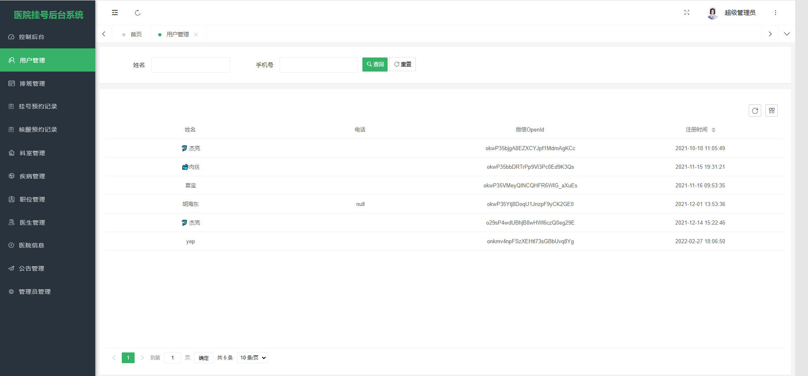
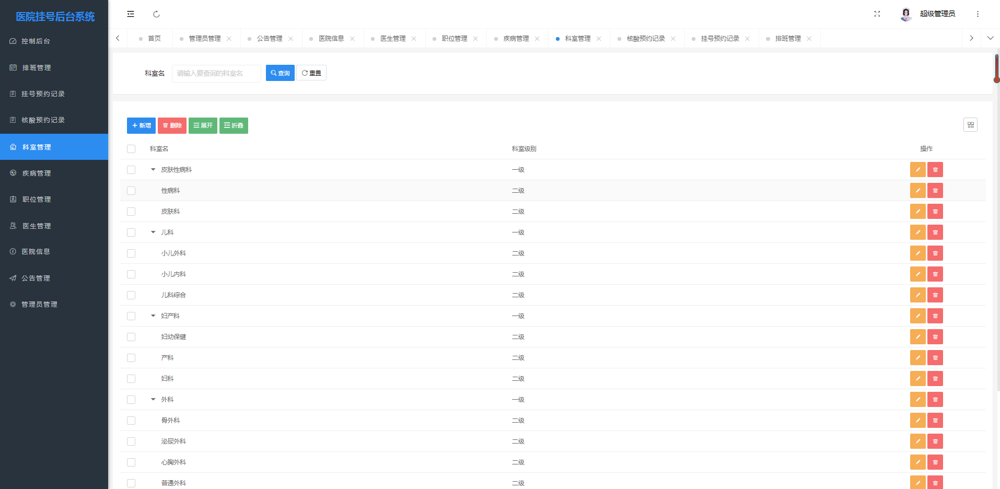
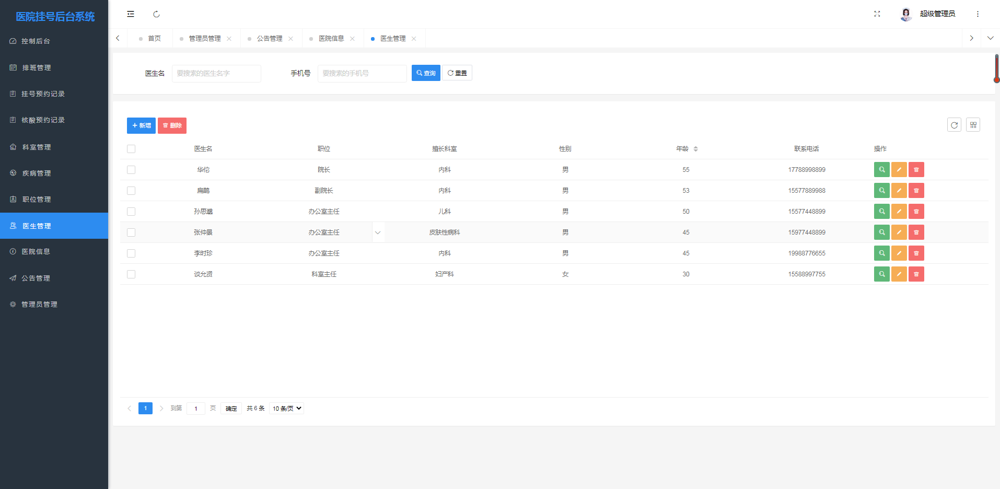
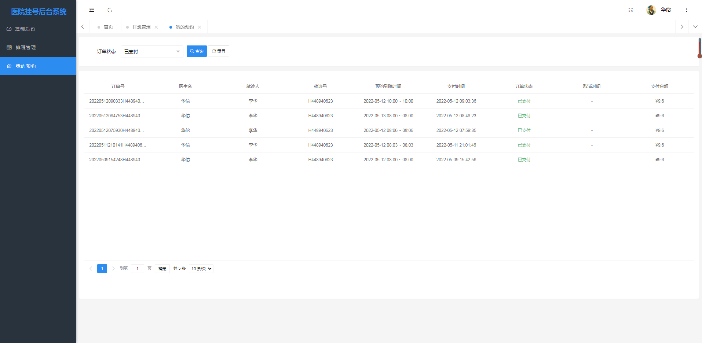
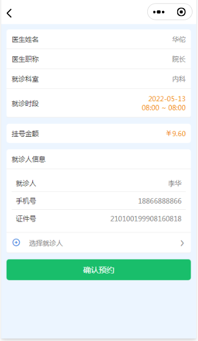
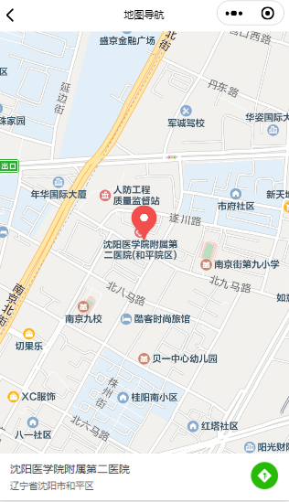
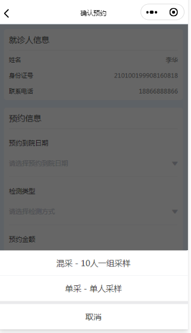

# 基于SpringBoot的医院挂号小程序


#### 介绍

​		伴随着我国经济快速发展，互联网技术在国内也得到了飞速发展，甚至可以说，信息化技术和人类的生活已经密不可分。现在一些发达城市的医院为了方便患者就医开发了适合患者运用的挂号系统，不仅减少了去医院花费大量时间排队预约挂号的麻烦而且对于医生而言也减少了很多的工作量。用信息化去管理患者挂号就医问题，用系统去管理医生和科室以及发布一些通知，不仅不会出错，而且系统内各种信息都便于管理员去查询和操作。那么这时候一个好用的医院挂号系统显得尤为的重要。

​		基于此，本人开发了一个医院挂号系统，专门用于线上患者预约挂号。医院挂号管理系统的设计我将主要的方向放在了如何能够提用户服务操作，同时管理员可以更加简洁的进行管理。通过查阅文献和对小区进行调研，我设计开发了前台用户可以进行登录、预约挂号、核酸检测等操作，管理员可以在后端对于用户信息、医院信息、医生以及职位管理等功能可以简单有效的管理系统信息的医院挂号管理系统。

```
本系统后台系统主要使用Java语言
后台整体架构采用：SpringBoot + MyBatisPlus + MySQL数据库
前台整体架构才用：uniapp + Vue + uView

后台分为医生和管理员两种角色
包含了：医生管理、排班管理、预约情况、医院信息、科室管理、用户管理等大大小小12个模块

小程序客户端
包含了：公告通知、预约挂号、联系客服、我的订单、核酸检测预约、定位导航等功能
```


#### 系统技术栈

后台：SpringBoot + MyBatisPlus + Thymeleaf+ Layui + PearAdmin + jQuery + JavaScript +  MySQL 

小程序端：uniapp + Vue


#### 项目截图

##### 管理员端截图

|  |  |
| ---------------------------------------------- | ---------------------------------------------- |
|  |  |


##### 用户端截图

|  |  |
| -------------------------------------------- | -------------------------------------------- |
|  |  |


#### 参与贡献

1.  斗佛

